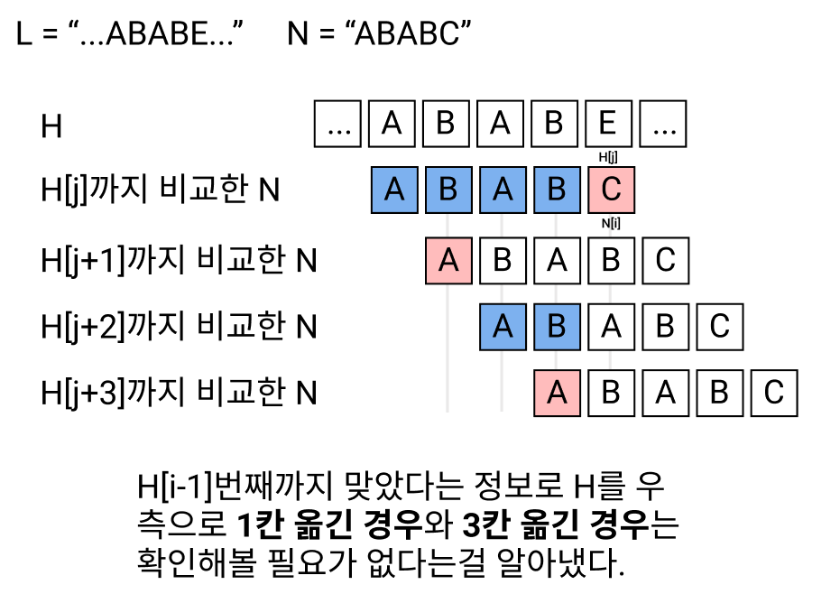

# [알고리즘] KMP
[프로그래밍 대회에서 배우는 알고리즘 문제 해결 전략](https://book.algospot.com/)을 보면서 정리한 내용입니다.

## 문자열 검색 문제
문자열 `N`이 문자열 `H`의 일부인지 확인하기 하고, 일치한다면 그 `H`에서의 시작 위치를 담는 문제를 문자열 검색 문제라고 한다.

예를 들어 `H = "ABCDE"`, `N = "BCD"`이면 `H[1:4]`가 `N`이 되므로 `H`는 `N`을 포함한다.
## 단순한 문자열 검색
이를 풀기 위해 가장 간단한 방법은 N의 가능한 모든 시작 위치를 확인해 보는 것이다.

### 코드
```python
def easy_search(H,N):
    result = []
    for h_idx in range(len(H)):
        checked = 1
        for n_idx in range(len(N)):
            if H[h_idx + n_idx] == N[n_idx]:
                continue     
            checked = 0
            break
        
        if checked:
            result.append(h_idx)
    return result
r =easy_search("ABCDE","BCD")
print(r)

```
### 단점
위 코드는 문자열의 모든 문자에 대해 비교해, 시간복잡도가 `O(len(N)*len(M))`이다. 문자열의 길이가 길다면 비효율적이다.

## KMP 알고리즘
그래서 나온게 KMP 알고리즘이다. 위의 단순 비교에서는 버려지는 정보가 존재한다. `H[i] == N[j]`에서 틀렸다면 위 코드에서는 `H[i+1]`를 `N[0]`부터 다시 비교하지만  `N[j - 1]`까지는 맞았다는 정보를 재사용하면 시간복잡도를 줄일 수 있다.
### 얻어낸 정보

이 정보를 이용해서 바로 2칸 옮긴 경우부터 탐색을 하면 된다.
### 그렇다면
몇번째에서 틀렸는지를 가지고 다음에 탐색해야할 경우를 찾아놓는다면 빠르게 문자열 비교를 수행할 수 있다. 이 개념을 적용한 문자열 검색 알고리즘이 **KMP 알고리즘**이다.

## 부분 일치 테이블

- `N`이 i 번째까지 맞았을 경우 탐색을 시작할 다음 위치
  
|i|탐색을 재개할 N의 다음 위치|
|---|---:|
|0|0|
|1|0|
|2|1|
|3|2|
|4|0|
|5|1|
|6|2|
|7|0|
i번째까지 일치했을 때 다음 시작할 위치를 담고 있는 이 테이블을 **부분 일치 테이블**이라고 한다. (일치가 실패했을 때 어떻게 해야하는지 말해준다는 의미에서 **실패 함수**라고 부르기도 한다.)

다음 시작 위치가 되기 위해서는 `N[:i+1]`까지의 시작 부분과 끝 부분이 일치해야햔다. 즉 접두사와 접미사가 같을 때의 최대 길이가 된다.

부분 일치 테이블을 `pi`라고 두면,

```
pi[i] = N[:i+1]의 접두사이자 접미사인 문자열의 최대 길이
```
로 정의할 수 있다. 그렇다면 이 부분 일치 테이블은 어떻게 만들까?

### 단순한 코드
```python
def get_partial_match(N):
    M = len(N)
    pi = [0] * M
    for begin in range(1,M):
        for f_len in range(M - begin):
            if N[begin + f_len] != N[f_len]: # begin + f_len == i
                break
            pi[begin + f_len] = max(pi[begin + f_len], f_len+ 1)
    return pi
```
단순히 모든 경우에 대해 비교함으로써 부분 일치 테이블을 만들 수 있다. `N`이 짧은 경우에는 상관 없지만 `N`이 길 경우에는 시간 복잡도가 `O(N^2)`이기에 비효율 적이다.

### KMP를 적용한 코드
``` python
def better_get_partial_match(N):
    M = len(N)
    pi = [0] * M
    
    begin = 1
    matched = 0
    while begin + matched < M:
        if N[begin + matched] == N[matched]:
            matched += 1
            pi[begin + matched - 1] = matched
        elif matched == 0:
            begin += 1
        else:
            begin += matched - pi[matched - 1]
            matched = pi[matched - 1]
    return pi
```

