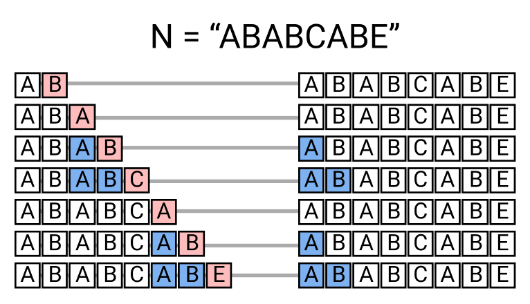

# [알고리즘] KMP
[프로그래밍 대회에서 배우는 알고리즘 문제 해결 전략](https://book.algospot.com/)을 보면서 정리한 내용입니다.

## 문자열 검색 문제
문자열 `N`이 문자열 `H`의 일부인지 확인하기 하고, 일치한다면 그 `H`에서의 시작 위치를 담는 문제를 문자열 검색 문제라고 한다.

예를 들어 `H = "ABCDE"`, `N = "BCD"`이면 `H[1:4]`가 `N`이 되므로 `H`는 `N`을 포함한다.
## 단순한 문자열 검색
이를 풀기 위해 가장 간단한 방법은 N의 가능한 모든 시작 위치를 확인해 보는 것이다.

### 코드
```python
def easy_search(H,N):
    result = []
    for h_idx in range(len(H)):
        checked = 1
        for n_idx in range(len(N)):
            if H[h_idx + n_idx] == N[n_idx]:
                continue     
            checked = 0
            break
        
        if checked:
            result.append(h_idx)
    return result
r =easy_search("ABCDE","BCD")
print(r)

```
### 단점
위 코드는 문자열의 모든 문자에 대해 비교해, 시간복잡도가 `O(len(N)*len(M))`이다. 문자열의 길이가 길다면 비효율적이다.

## KMP 알고리즘
그래서 나온게 KMP 알고리즘이다. 위의 단순 비교에서는 버려지는 정보가 존재한다. `H[i] == N[j]`에서 틀렸다면 위 코드에서는 `H[i+1]`를 `N[0]`부터 다시 비교하지만  `N[j - 1]`까지는 맞았다는 정보를 재사용하면 시간복잡도를 줄일 수 있다.
### 얻어낸 정보

이 정보를 이용해서 바로 2칸 옮긴 경우부터 탐색을 하면 된다.
### 그렇다면
몇번째에서 틀렸는지를 가지고 다음에 탐색해야할 경우를 찾아놓는다면 빠르게 문자열 비교를 수행할 수 있다. 이 개념을 적용한 문자열 검색 알고리즘이 **KMP 알고리즘**이다.

### 부분 일치 테이블

- N이 i 번째에서 틀렸을 경우 탐색을 시작할 다음 위치
  
|i|탐색을 재개할 N의 다음 위치|
|---|---|
|0|0|
|2|0|
|3|내용 10|
|4|내용 10|
|5|내용 10|