# [react]OAuth2.0 엔드포인트로 직접 구현해보기!

구글, 네이버, 카카오 등 다양한 소셜 로그인. 어떻게 구현될까?
간단하게 구글 소셜 로그인을 클라이언트에서 구현해보기로 했다.

# 1. 개념

개념적으로는 이렇게 돌아간다.

## 기본 단계

OAuth 2.0을 이용해 Google API에 액세스한다면 아래 단계를 거치게 된다. (간략화 했음)

1. OAuth 2.0 자격증명을 Google API 콘솔에서 얻기
2. Google Authorization Server에서 액세스 토큰을 얻기(유저가 로그인) - 이 과정에서 로그인만 일어날 수도 있고, 민감한 정보라면 추가 동의가 필요함.
3. 획득한 액세스 토큰을 가지고 Google API에 접근하기.

## 클라이언트의 시퀀스 다이어그램

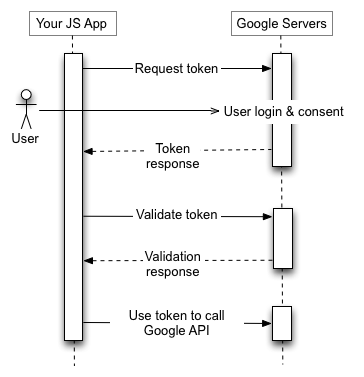
그림으로 나타내면 다음과 같은 과정으로 일어난다.

# 2. 구글 API Console에서 OAuth2.0 자격 증명 얻기

우선 [Google API Console](https://console.developers.google.com/)을 방문해 OAuth2.0 자격 증명을 획득해야한다. 획득한다면 `client ID`와 `client seceret`을 얻게 된다. 이 두 개의 키는 프로그램의 종류에 따라 요구된다.

처음하는 사람을 위해 각각의 과정을 상세히 적겠습니다.

## 2.1. Google Cloud Plarform 등록하기

구글 클라우드 플랫폼을 처음 사용한다면 간단한 등록을 해야한다.
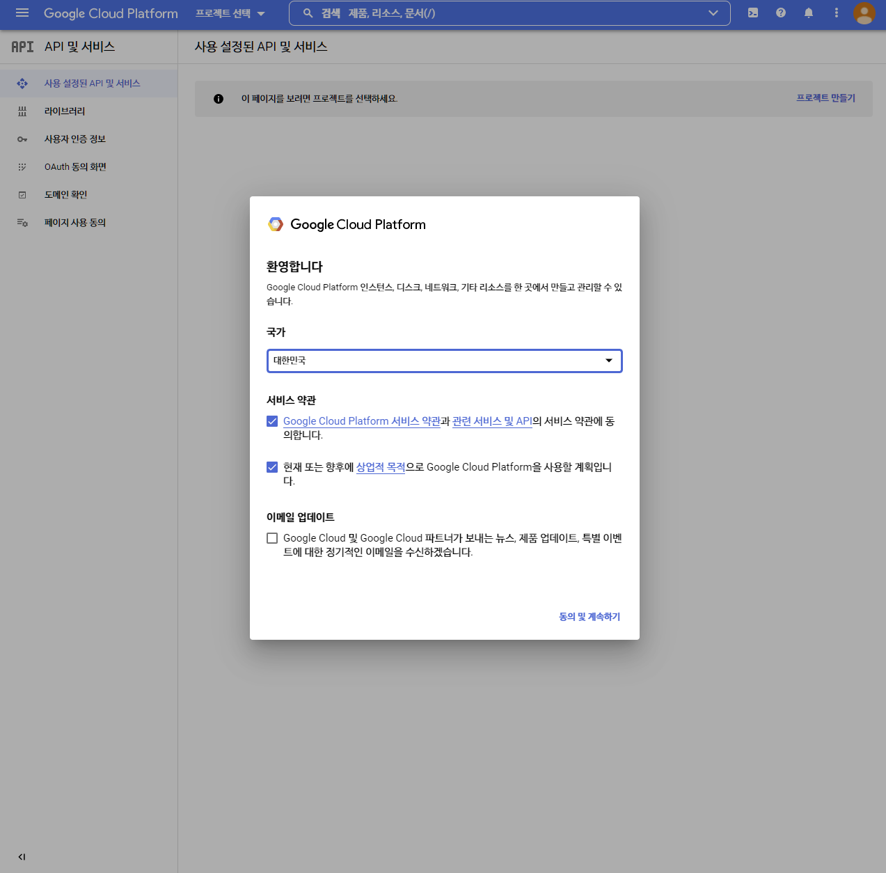
이미 등록한 사용자라면 저런 창이 나오지 않는다.

## 2.2. 프로젝트 만들기

우선 프로젝트를 만들어야 한다. 우측의 파란 `프로젝트 만들기` 버튼을 클릭하자.
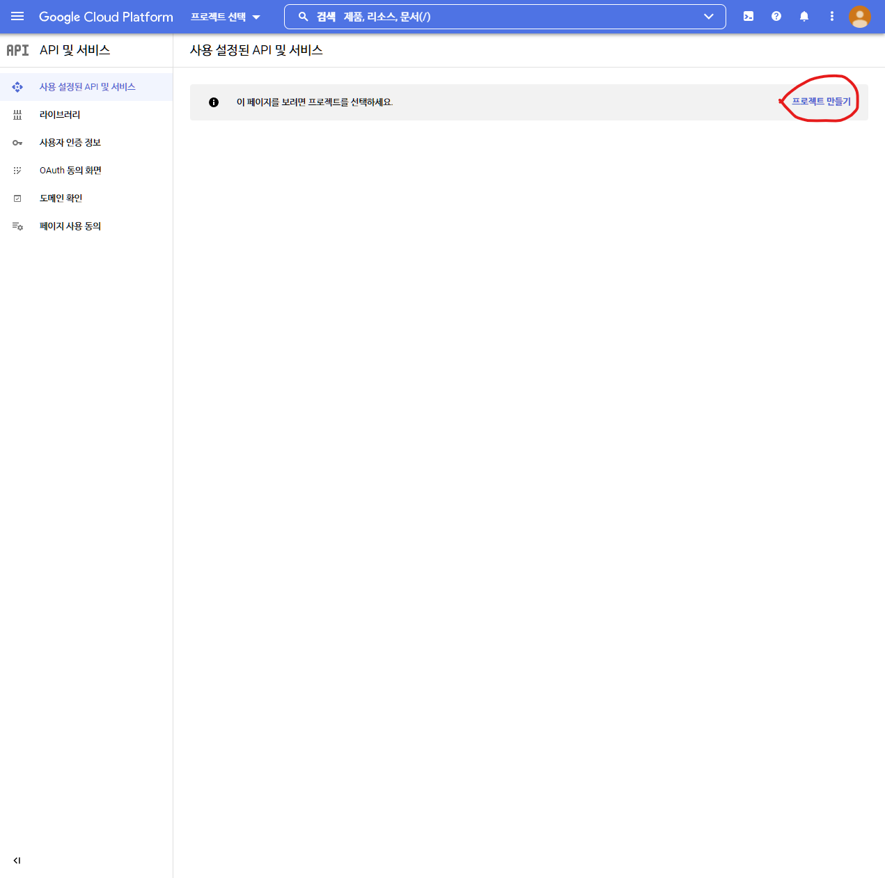
그러면 간단하게 프로젝트 정보를 입력하는 창이 나온다. 프로젝트 이름은 하고 싶은 대로 넣어주면 된다.

프로젝트의 위치(카테고리)를 정하는 조직과 위치 또한 적당히 넣어주면 되는데, 나는 학교 계정이여서 강제로 할당됐다.
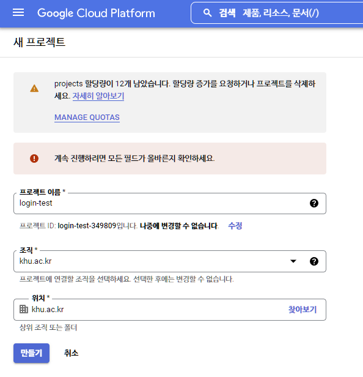
만들기를 누른다면 처음 창으로 이동된다. 프로젝트가 만들어진다면 창이 새로고침이 되며 UI가 달라지니 그때까지 기다리자.

## 2.3. OAuth 동의 화면 구성하기

만들어졌다면 좌측 탭의 `OAuth 동의 화면`을 클릭해 동의 화면을 구성하자. 동의 화면은 추후 나오겠지만 민감한 정보에 접근하고자 하거나 소셜 로그인 과정에서 앱의 정보를 유저들이 확인가능하게 정보를 넣어주는 과정이다.
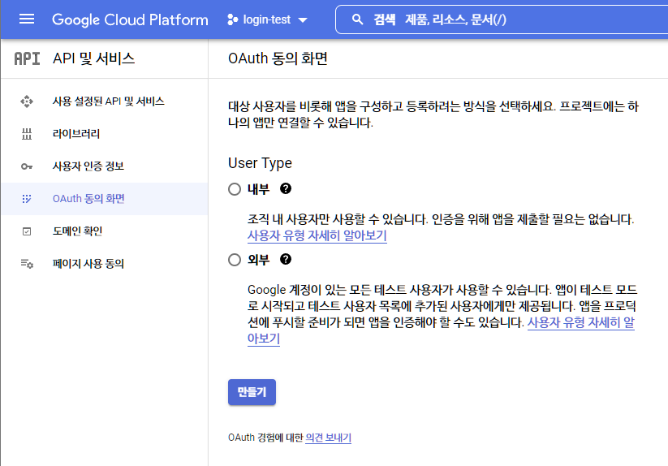
애플리케이션을 내부에서 사용할지 외부에서 사용할지를 정하는 단계인데, 나는 모든 사용자들이 사용 가능하게 할 것이므로 외부로 했다.

외부로 정하더라도 당장 인증을 해야하는 것은 아니니 걱정하지 말자.
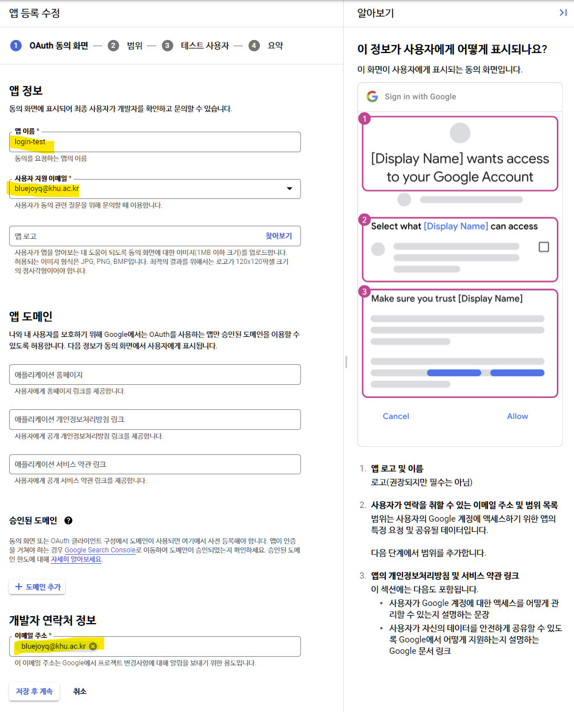
다음 단계는 동의 화면 구성하기이다. 우측의 예시 화면을 채우는 것인데. 당장은 밑줄친 부분만 해도 상관 없다.

> 프로덕션으로 할거면 나머지 항목도 꼭 채우기!

다음은 소셜 로그인을 통해 얻고자 하는 정보의 범위(scope)를 고르는 것이다.

> 더 자세한 내용은 [OAuth 2.0 Scopes for Google APIss](https://developers.google.com/identity/protocols/oauth2/scopes) 참조

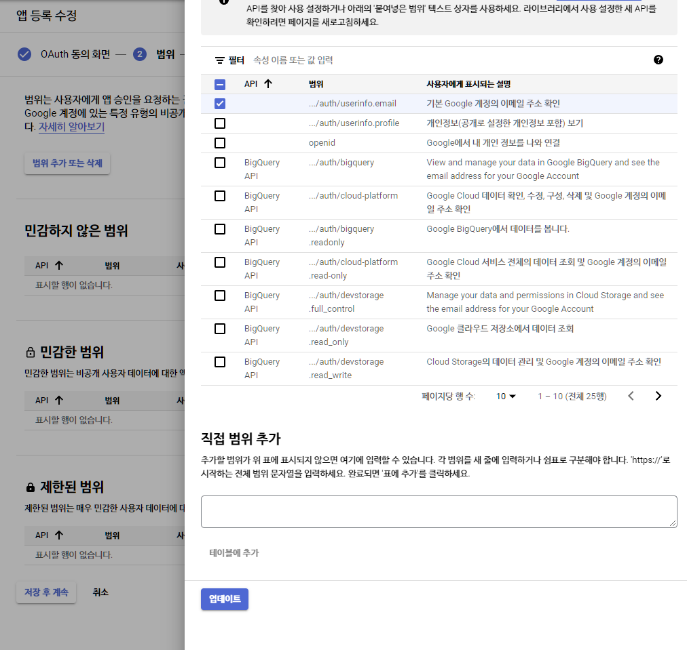
나는 간단하게 이메일을 추가해 보았다. 만약 민감한 데이터를 얻고자하면 아래와 같이 분류가 따로 진행되며 유저가 로그인 후 추가적인 동의를 진행해야 한다.
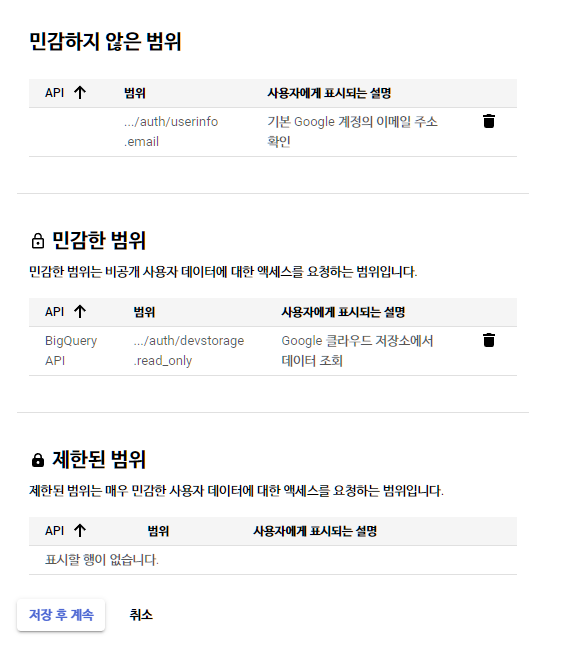
마지막으로 테스트 사용자를 추가해야한다. 아까 언급했듯이 외부 사용자들을 대상으로 해도 프로덕션 전에는 아무나 접근할 수 없다. 이 곳에 테스트 계정을 추가한다면 이 계정들만 이 앱의 소셜 로그인을 사용할 수 있다.
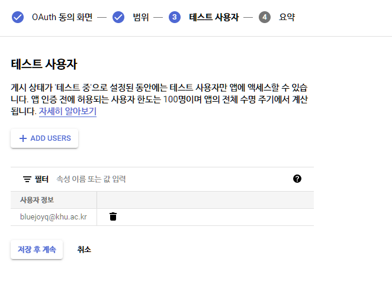
여기까지한다면 간단한 요약이 나올텐데 동의화면 구성이 끝이 났다.

## 2.4. OAuth 2.0 클라이언트 ID 발급

그 다음은 처음에 언급한 `client ID`와 `client seceret` 획득하기이다.
좌측의 `사용자 인증 정보`를 클릭해 이동하자.
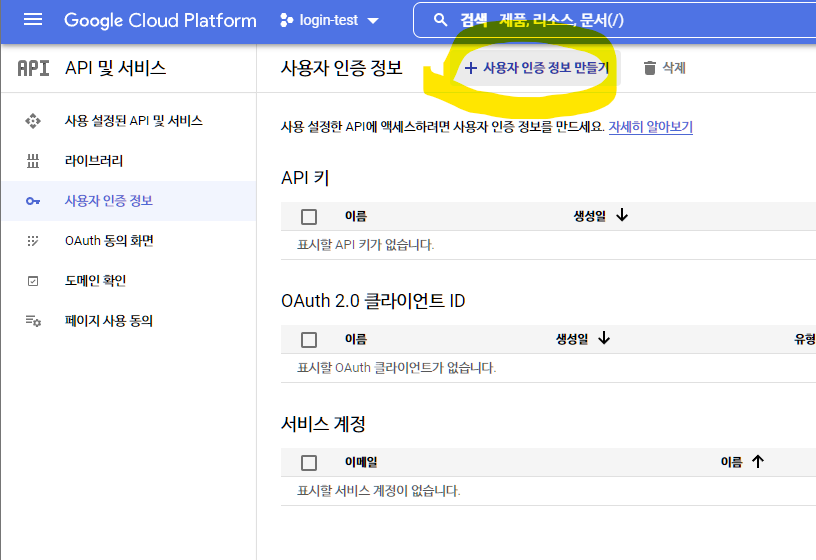
해당 탭에서 상단의 `사용자 인증 정보 만들기`를 눌러 나오는 메뉴에서 `OAuth 클라이언트 ID`를 누르자.

`애플리케이션 유형`을 고른다면 아래 폼이 생겨난다. 나는 웹 애플리케이션을 골랐다(리액트니까 당연히 웹).

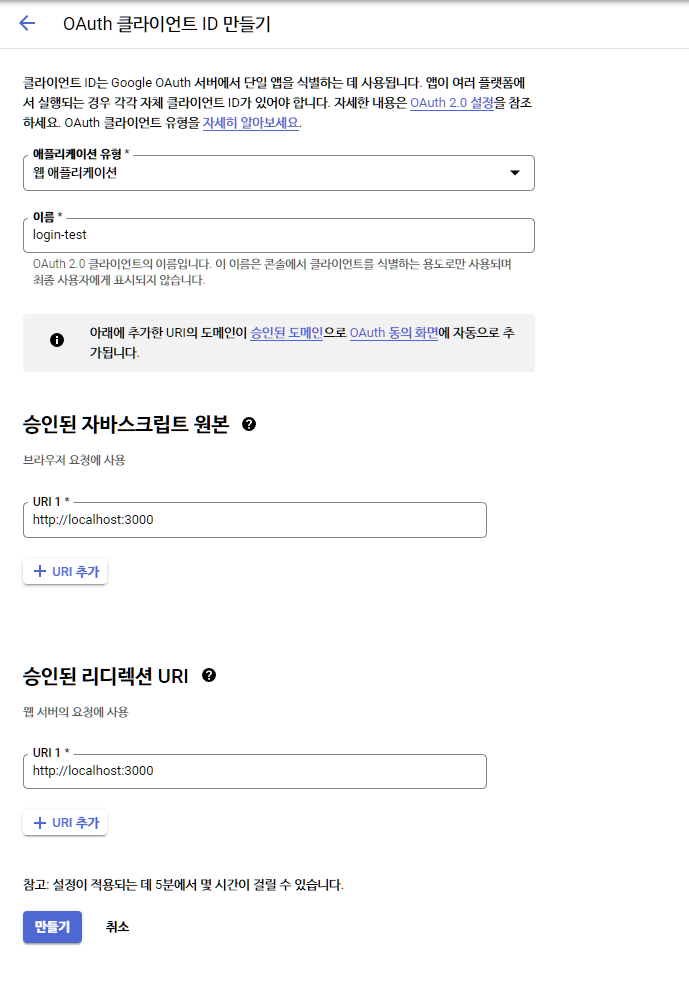
애플리케이션 이름을 채워주고, 브라우저 요청에서 사용할 경로를 추가해주면 되는데, `localhost:3000`으로 했다.
승인된 리디렉션 URI은 로그인 후 어느 경로로 이동 가능한지를 정해준다. (나중에 요청시에 param 따라 고르기 가능)
사진에는 `localhost:3000`이라고 적어놨지만 `localhost:3000/redirect`로 구성했다.

다음으로 넘어간다면
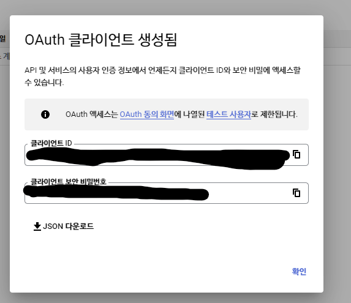
마침내 `클라이언트 ID`와 `클라이언트 seceret`이 나온다.

잘복사해서 간직하자.

# 3. React에서 사용하기

가장 좋은 방법은 잘 구현된 라이브러리를 사용하는 것이다.
[react-google-login 라이브러리](https://github.com/anthonyjgrove/react-google-login)

굳이 구현하고 싶다면 아래 과정을 따라하시면 됩니다. 그리고 현재 구현한 코드는 좋은 방법이 아닌 것 같다. 전역적으로 로그인과 로그아웃 함수를 만들고 관리해야할 것 같은데... 이게 맞는지 모르겠다!!

## 3.1. 프로젝트 구조 및 사용 라이브러리

| 프로젝트 구조            | 사용 라이브러리            |
| ------------------------ | -------------------------- |
| 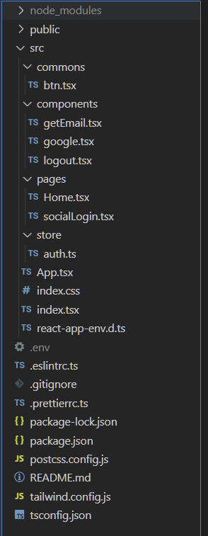 | 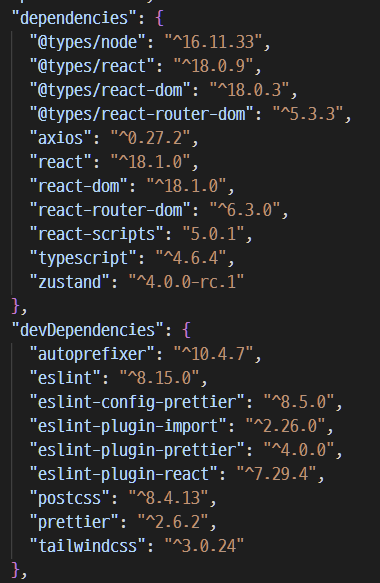 |

### 3.1.1. 사용 라이브러리

사용 라이브러리에서는 `axios`와 `zustand`가 핵심이다.

> **zustand** : 보다 간단하게 flux 패턴으로 전역 상태를 관리하게 해주는 라이브러리

### 3.1.2. 프로젝트 구조

- `/.env` : 아까 발급받은 **클라이언트 ID**와 **클라이언트 seceret**이 **REACT_APP_GOOGLE_ID**와 **REACT_APP_GOOGLE_TOKEN**라는 키로 저장되어 있다.
- `/src/App.tsx` : 라우팅 담당
- `/src/store/auth.ts` : **zustand**를 이용한 전역 로그인 상태 존재.
- `/src/pages/Home.tsx` : 구글 소셜 로그인과 로그인이 됐는지 이메일 불러오기 기능, 로그아웃을 진행하는 버튼 존재.
- `/src/pages/socialLogin.tsx` : 구글 로그인으로부터 redirect되면 해당 URL에서 **access token** 추출해 스토어에 저장 후 홈으로 리다이렉트

## 3.2 App.tsx

redirect 후 URL의 hash에서 `access token`을 분리하기 위해 redirect 경로로 접근시 `SocialLogin` 컴포넌트에서 처리한다.

```tsx
import { ReactElement } from "react";
import { BrowserRouter, Routes, Route } from "react-router-dom";
import Home from "./pages/Home";
import SocialLogin from "./pages/socialLogin";
const App = (): ReactElement => {
  return (
    <BrowserRouter>
      <Routes>
        <Route path="/" element={<Home />} />
        <Route path="redirect" element={<SocialLogin />} />
      </Routes>
    </BrowserRouter>
  );
};

export default App;
```

## 3.3 home.tsx

로그인과 이메일 확인, 로그아웃을 진행하는 버튼 3가지가 나란히 있다. 각 버튼을 담당하는 컴포넌트가 `google`, `getEmail`, `logout`이다.
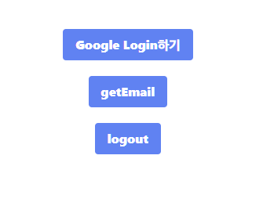

```tsx
import { ReactElement } from "react";
import Google from "../components/google";
import GetEmail from "../components/getEmail";
import Logout from "../components/logout";

const Home = (): ReactElement => {
  return (
    <div className="w-full h-64 flex justify-center items-center flex-col gap-5">
      <Google />
      <GetEmail />
      <Logout />
    </div>
  );
};

export default Home;
```

### 3.3.1 google.tsx

이 버튼을 누르면 구글 소셜 로그인을 진행 후 /redirect로 리다이렉트한다. 이 이후의 진행은 `socialLogin.tsx`에서 진행한다.

```tsx
import { ReactElement } from "react";
import { CustomBtn } from "../commons/btn";
const GOOGLE_ID = process.env.REACT_APP_GOOGLE_ID;
const GoogleURL: string = `https://accounts.google.com/o/oauth2/v2/auth?client_id=${GOOGLE_ID}&response_type=token&redirect_uri=http://localhost:3000/redirect&scope=https://www.googleapis.com/auth/userinfo.email`;

const Google = (): ReactElement => {
  const oAuthHandler = (): void => {
    window.location.assign(GoogleURL);
  };

  return <CustomBtn onClick={oAuthHandler}>Google Login하기</CustomBtn>;
};

export default Google;
```

api의 형식은
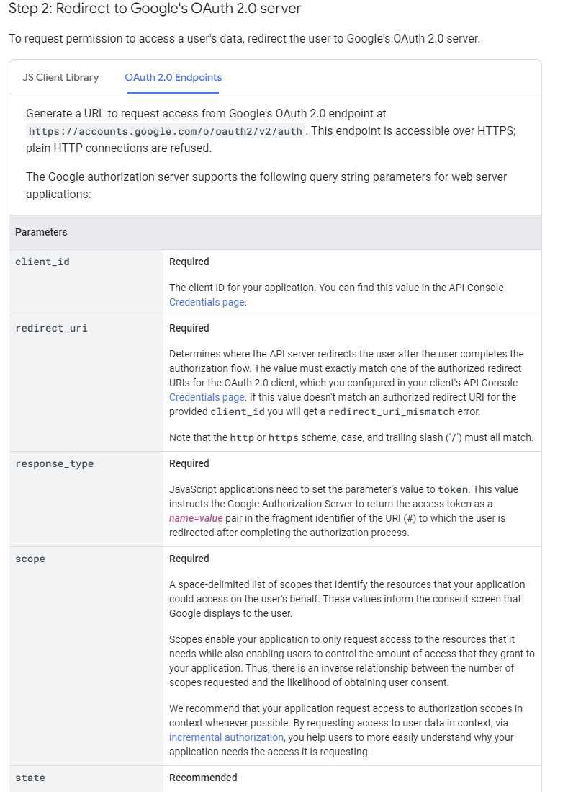
[Step 2: Redirect to Google's OAuth 2.0 server](https://developers.google.com/identity/protocols/oauth2/javascript-implicit-flow#redirecting)에 나와있다.

### 3.3.2 getEmail.tsx

얻은 `access token`은 전역적으로 `AuthStore`에서 관리된다. 이 토큰을 google api 서버로 보낸다면 유저 정보를 얻을 수 있다.

다른 참조한 글에서는 param으로 요청을 보냈는데 그렇게 하면 cors 문제가 발생해서 헤더에 넣어줬다.

`Bearer`는 토큰 인증 관련 방법이다.
[토근 기반 인증에서 bearer는 무엇일까?](https://velog.io/@cada/%ED%86%A0%EA%B7%BC-%EA%B8%B0%EB%B0%98-%EC%9D%B8%EC%A6%9D%EC%97%90%EC%84%9C-bearer%EB%8A%94-%EB%AC%B4%EC%97%87%EC%9D%BC%EA%B9%8C) 참조

```tsx
import axios from "axios";
import { ReactElement } from "react";
import { CustomBtn } from "../commons/btn";
import useAuthStore from "../store/auth";

const getEmail = (): ReactElement => {
  const authToken = useAuthStore((state) => state.authToken);

  const CheckAuth = async (accessToken: string) => {
    await axios
      .get("https://www.googleapis.com/oauth2/v2/userinfo", {
        headers: {
          Authorization: `Bearer ${accessToken}`,
        },
      })
      .then((res) => {
        alert(res.data.email);
      })
      .catch((err) => {
        alert("oAuth token expired");
        window.location.assign("http://localhost:3000");
      });
  };
  return (
    <CustomBtn
      onClick={() => {
        CheckAuth(authToken);
      }}
    >
      getEmail
    </CustomBtn>
  );
};

export default getEmail;
```

응답의 형식은 다음과 같다.

```json
{
  "id": "someID",
  "email": "someEmail",
  "verified_email": true,
  "picture": "somePicture"
}
```

왜 이메일을 허용했는데 유저 정보가 나오는지는 잘 모르겠지만
[openid-connect](https://developers.google.com/identity/protocols/oauth2/openid-connect)와 [사용자의 이메일 주소를 얻기 위한...](https://copyandpaste.tistory.com/109)이 도움이 될 것 같다. 추후 이 내용은 보강하겠습니다.

> 아시는분 알려주세요! google api 써보신분 왜 scope를 email로만 했는데 userinfo가 다 받아지는건가요?

### 3.3.3 logout.tsx

로그아웃 요청을 담당하는 버튼이다. 로그아웃 요청을 보낸 이후 `AuthStore`에서 토큰을 삭제한다.
[Revoking a token](https://developers.google.com/identity/protocols/oauth2/javascript-implicit-flow#tokenrevoke) 참조

```tsx
import axios from "axios";
import { ReactElement } from "react";
import { CustomBtn } from "../commons/btn";
import useAuthStore from "../store/auth";

const Logout = (): ReactElement => {
  const logout = useAuthStore((state) => state.logout);
  const authToken = useAuthStore((state) => state.authToken);
  const handleLogout = async () => {
    logout();
    await axios
      .post(`https://oauth2.googleapis.com/revoke?token=${authToken}`)
      .then(() => {
        window.location.assign("http://localhost:3000/");
      })
      .catch(() => {
        alert("로그아웃에 실패했습니다.");
      });
  };

  return <CustomBtn onClick={handleLogout}>logout</CustomBtn>;
};

export default Logout;
```

## 3.4. socialLogin.tsx

로그인 후 이곳으로 리다이렉트가 된다. 리다이렉트가 되면서 URL의 hash에 토큰 관련 정보를 담게 되는데 이런 형식이다.

```tsx
`http://localhost:3000/redirect#access_token=${accessToken}&token_type=Bearer&expires_in=3599&scope=email%20https://www.googleapis.com/auth/userinfo.email%20openid&authuser=0&prompt=consent`;
```

위 hash를 가져와 `access token`을 얻을 수 있다. 가져온 토큰을 `AuthStore`에 담아준다.

```tsx
import { ReactElement, useEffect } from "react";
import { useNavigate } from "react-router-dom";
import useAuthStore from "../store/auth";
const SocialLogin = (): ReactElement => {
  const login = useAuthStore((state) => state.login);
  const navigate = useNavigate();
  useEffect(() => {
    const url = new URL(window.location.href);
    const hash = url.hash;
    if (!hash) return;
    // 주소에서 acesstoken 따오기
    // 코드 출처 https://velog.io/@tkdfo93/%EA%B5%AC%EA%B8%80-OAuth2.0-Final-Project
    const accessToken = hash.split("=")[1].split("&")[0];
    login(accessToken);
    navigate("/");
  }, [login, navigate]);
  return <div></div>;
};

export default SocialLogin;
```

# 4. 소감
google api 공식 문서는 너무 불친절하다. 다른 소셜 로그인도 비슷한 방식이라고 하니까 네이버로 다시 만들어봐야지!.

# 5. 참고 문헌

- https://developers.google.com/identity/protocols/oauth2 의 모든 글(근데 scopes는 도대체 어떻게 보는거임??????)
- https://velog.io/@tkdfo93/%EA%B5%AC%EA%B8%80-OAuth2.0-Final-Project 좋은 코드를 제공해주셨지만 cors도 함께 주신 글
