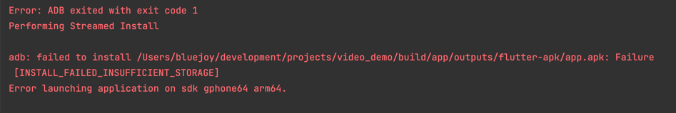
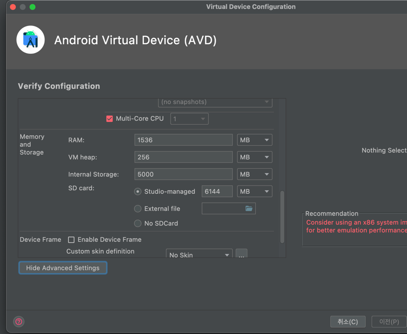
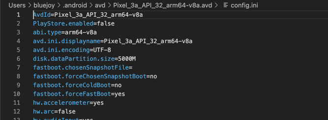

# [안드로이드] avd 내장 메모리 사이즈 늘리기
## 작성 계기
최근 앱을 공부하고 있다. flutter를 이용해서 열심히 
공부를 하고 있었는데, 여러 프로젝트를 전환하며 실행을 하다보니
자꾸 이런 에러 메세지가 떳다.

```
INSTALL_FAILED_INSUFFICIENT_STORAGE
```
## 시행착오
### AVD manange를 통한 수정
당연히 보자마자 아 에뮬레이터 내장 공간이 부족하구나~하고 
avd manager의 설정을 수정해주었다.


그러나 아무리 늘려도 에뮬레이터에서는 저장 공간이 변화가 없었다.

### config.ini 수정
https://dcmru.tistory.com/2511037  
위 글을 보고 `~/.android/avd/<name.avd>/config.ini`
의 `disk.dataPartition.size=5000m`으로 넉넉하게 할당
해주었지만 여전히 바뀌지 않았다.


## 해결
https://developercommunity.visualstudio.com/t/cant-change-internal-storage-size-on-android-emula/324511  
이 글을 보고 드디어 해결했다.
이미 한번 실행을 했다면, 변경을 해주고 나서 변경이 반영되게 하기 위해서는 아예 초기화를
시켜야하는 듯 하다.
`~/.android/avd/<name.avd>/userdata-qemu.img`  
이 이미지 파일을 삭제하고 다시 실행하니 됐다.